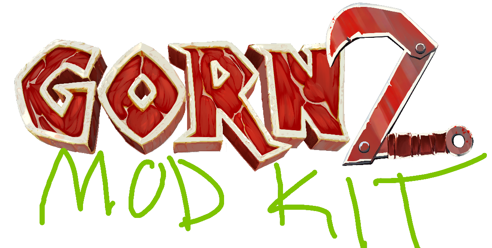

The official modding toolkit for the VR game **GORN2**.

## 🔩 How to Install the Mod Kit
The Mod Kit requires the Unity game engine to create and export mods to GORN2.
1. Download and install [Unity Hub](https://unity.com/download).
2. Locate and install the Unity version **2022.3.60f1** from [here](https://unity.com/releases/editor/archive).
   - Make sure to include the module **Android Build Support** during the installation to be able to export mods for android devices.
3. Download the Mod Kit project by either cloning the repository using [git](https://git-scm.com/) or download it a `.zip` file using the dropdown **Code → Download ZIP** at the top of this page and unzip the file.
4. In **Unity Hub**, **Add project from disk** and select the root folder of the unzipped project.
5. Open the project from **Unity Hub**.

## 🛠️ How to Export a Mod  
1. Mark the assets you want to export as [Addressable](https://docs.unity3d.com/Packages/com.unity.addressables@1.22/manual/get-started-make-addressable.html).
2. Switch the platform in [Build Settings](https://docs.unity3d.com/2022.3/Documentation/Manual/BuildSettings.html) to either **Windows** or **Android**, depending on your target platform.
3. Use **Mod Tools → Build** to build the mod into a `.zip` file.
4. Locate the generated `.zip` via the link printed in the [Console window](https://docs.unity3d.com/2022.3/Documentation/Manual/Console.html).
5. Upload the `.zip` file to your mod page on [GORN2 at Mod.io](https://mod.io/g/gorn-2), making sure to upload it to the correct platform.
6. Navigate to `[Project]/ServerData/[Platform]/` and zip the output files.
7. Upload this `.zip` file to your mod page on Mod.io.
8. Subscribe the mod via the **Modio** menu inside the game.

## ⛔ Limitations

### No Custom Scripts  
Custom scripts cannot be included in mods. Instead, use the available **behavior tree components** provided in the project to create complex logic. You can also use the various **"reactive" components** to link properties between objects and build interactive behaviors.

### Limited Testing in the Unity Editor  
While most components from the main game have been imported into the Mod Kit, many lack full implementation details. These components can be used in mods but cannot be fully tested in the Unity Editor.  
To test your mod, upload it to [Mod.io](https://mod.io/g/gorn-2), download it in-game, and test it within the GORN2 runtime.

### Not Everything is Moddable  
Some systems and content from the main game are not exposed for modding, for example player movement. It is possible that this will change and be exposed to modders in future GORN2 patches.

## 📂 Examples and Guidelines  
Example mods can be found under `Assets/Examples/`, most of which include `README` files with export instructions and usage tips.

Additional guidelines are located in `Documentation/`.

## 🔪 Adding Custom Weapons  
You can create custom weapons that appear in the **Custom Mode** weapons menu.

- Create a weapon prefab (refer to `Assets/Cortopia/Prefabs/Weapons/BoneClub.prefab` for reference).
- Mark the prefab as **Addressable** and assign it the label `Weapon`.
- Add the `ObjectDescription` component to the root object of the prefab to assign a custom icon and display name in the Custom Mode menu (the displayed name is the prefab's name).

## 🪖 Adding Custom Armor Sets  
Custom armor sets appear in **Custom Mode**, where players can choose which armors enemies spawn with.

- Create an armor set prefab (e.g., `Assets/Cortopia/Prefabs/Armor/ArmorSet_Iron.prefab`).
- Mark it as **Addressable** with the label `Armor`.
- Add the `ObjectDescription` component to the root object to assign a custom icon for the menu (the displayed name is the prefab's name).

## ⛰️ Adding Custom Levels  
You can create custom levels accessible from the **Mod Levels** portal in **Custom/Endless Mode** in the **Hub**.

- Mark your scene as **Addressable** with the label `Scene`.
- Include it when exporting your mod.
- Refer to `Assets/Examples/SampleScene/SampleScene.unity` for setup guidance.
- Use the `PlayerStartPoint` component to define the player’s spawn location. You can place the prefab from `Assets/Cortopia/Prefabs/PlayerStartPoint.prefab` in your scene.

## 💥 Using GORN2 Physic Materials  
The Mod Kit includes physic materials from the main game. These not only define physical interactions but also control collision effects, audio, VFX, and penetration logic via the `Piercing` component.

To use them:

- **Do not** assign these materials directly in the `Material` field in `Collider` components.
- Instead, reference them via the `ColliderMaterialReference` component on your objects.  
This ensures that the correct materials are used in-game without duplicating them, which could cause issues with collisions or effects.

## 👉 Referencing Main Game Assets  
The Mod Kit includes many prefabs from the main game. While most do not contain full implementations, they can still be referenced via the Addressables system.

Example:  
Use the `SingleSpawner` component to spawn main game assets using Addressable references.

## 🔀 Overriding Existing Game Assets  
Mods can override certain game assets. For example, you could replace swords with shovels, swap enemy types like Rokibes with chickens or change the armor sets used in the campaign levels.

To do this:

1. Mark the mod asset as **Addressable**.
2. Change its address to match the address of the asset you want to override.
   - To find an asset's address:  
     - Locate it in the `Assets/Cortopia/` folder,  
     - Or refer to `Documentation/AddressableAssetEntries.txt`.
   - Copy the address from the **Inspector** and paste it into your mod asset's address.
